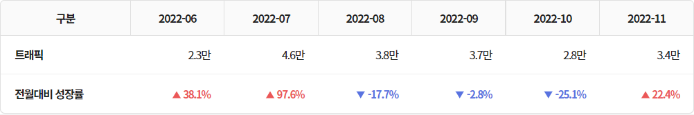
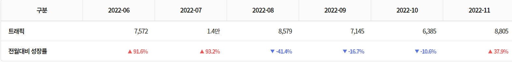
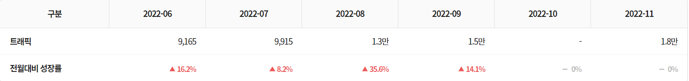
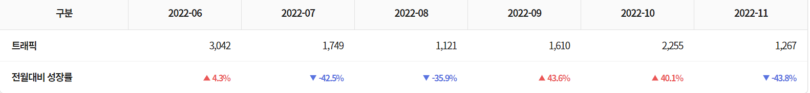
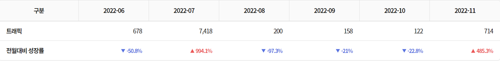

# 백엔드 직군

# 1.<비엘큐>

## 자격 요건
- TypeScript,Java,Python 중 하나이상의 언어를 활용하여 개발한 2-3년 이상의 경험이 있는분
- Spring Framework, Node.js,Django,FastAPI 등 일반적인 백엔드 프레임워크 중 하나 이상을 활용하여 개발한 2-3년이상의 경험이 있으신 분
- 기본적인 데이터베이스 관련 지식 및 SQL또는ORM을 통해 데이터베이스 접근에 이해가 있으신 분
- Git 등 버전 고나리 시스템에 대한 일반적인 사용 경험 및CI/CD를 활용한 소프트웨어 빌드 및 배포 경험이 있으신 분

## 우대 사항
- 비즈니스 요구사항에 따른 DB 설계 경험이 있으신 분
- 비즈니스 핵심을 이해하고 효율적인 데이터 구조 및 API 설계가 가능하신 분
- 컨테이너(Docker, Kubernetes) 및 퍼블릭 클라우드 환경(AWS, GCP 등)을 이용한 개발 및 배포 경험이 있으신 분
- NoSQL, 메시지 큐, 비동기 프로그래밍 등 최신 개발 트렌드에 대한 학습 또는 활용 경험이 있으신 분

# 2.<피아노버스랩>

## 자격 요건
- 학력 및 성별 무관
- 웹 API 백엔드 개발 경력 3년 이상 또는 이에 준하는 역량 보유자
- Python(3.8+) 언어에 능숙하신 분
- 웹에 대한 전반적인 이해가 있으신 분
- Database 및 SQL에 대한 기본적인 이해가 있으신 분
- 비지니스 요구사항을 빠르고 명확하게 기술 명세화가 가능하신 분
- 팀 플레이를 이해하고 협업 및 소통이 원활하신 분
- 자기 주도형 업무 리딩 능력 보유자
- 해외여행에 결격 사유가 없으신 분

## 우대 사항
- 컴퓨터 관련 전공자 혹은 이에 준하는 CS 기초 지식 보유자
- 웹에 대한 이해가 깊으신 분
- 웹 백엔드 프레임워크(FastAPI, Flask, Django 등) 기반 개발 실무 경험
- Git 및 GitHub 기반 협업 개발 실무 경험
- System Design/Software Architecture에 대한 이해
- Python 외 한 가지 이상 개발 언어에 능숙하신 분
- 보안에 대한 깊은 관심
- 개방, 공유, 존중, 애자일 문화에 익숙하신 분
- 새로운 기술을 빠르게 배우고 적용하는데 거부감이 없는 분
- 퍼블릭 클라우드(AWS, GCP, Azure 등) 기반 개발 경험
- CI/CD에 대한 경험
- DevOps 문화에 대한 이해

# 3.<레몬베이스>

## 자격 요건
- 백엔드 개발 경험 3년 이상 또는 그에 준하는 이해도가 있는 분
- Scalable한 시스템 구축에 대한 이해도를 보유한 분
- DDD(Domain Driven Design), Layered Architecture 에 대한 경험이 있으신 분
- 하나의 서비스를 개발하고 지속적으로 개선한 경험을 가지고 계신 분
- 고객의 관점에서 생각하고 이를 제품에 반영하려는 태도를 가지신 분

## 우대 사항
- 복잡한 도메인 로직을 가진 서비스 개발에 대한 경험을 가지고 계신 분
- SPA 기반의 웹 서비스 개발 경험을 가지고 계신 분
- Django, Spring, NestJS 등 웹 프레임워크 사용 경험을 가지고 계신 분
- AWS, GCP, Azure 등 클라우드 플랫폼 사용 경험 및 클라우드 기반 웹 서비스에 대한 이해를 가지고 계신 분
- 보안에 대한 이해가 있으신 분

# 4.<알로카도스>

## 자격 요건
- Python 개발 경험을 갖고 상당한 실력을 갖추신 분
- Flask, Django, FastAPI 중 최소 하나의 프레임워크 사용에 능숙하신 분
- RDBMS, NoSQL(MongoDB, Redis)에 대한 설계/개발 경험이 있으신 분
- 기본적인 개발능력 (알고리즘, 자료구조, 운영체제, DB 등)
- AWS/Azure 등의 클라우드 기반 개발 경험이 있으신 분
- 협업에 대해 긍정적이고 적극적인 마인드 및 문서화 능력이 있으신 분

## 우대 사항
- 자동화된 Unit test, integration test, Code review 등의 개발 문화에 익숙하신 분
- 데이터 파이프라인 (데이터 수집 - 분석 - 서빙) 시스템 개발 경험이 있으신 분
- Docker 기반 CI/CD에 대한 이해가 있거나 구현 경험이 있으신 분
- 실시간/메시징 서비스 개발 경험이 있으신 분
- 대규모 트래픽 처리 경험이 있으신 분

# 5.<원더윅스컴퍼니>

## 자격 요건
- Python 중상급!
- 팀원과의 원활한 의사소통 및 협업이 가능하신 분
- 클라우드 서비스 (AWS/GCP) 관리에 경험이 있으신 분
- REST API 기반 설계 경험이 있으신 분

## 우대 사항
- Flask/Fast API 경험이 있으신 분
- MongoDB, mongoengine 에 대한 경험이 있으신 분
- 비지니스 상황에 맞는, ‘최선의 기술’을 선택할 수 있는 분
- 내가 개발 좀 친다 하는 분 (가장 중요)

# 6.<빌리오>

## 자격 요건
- 서버 개발 경력 3년 이상 또는 이에 준하는 역량을 갖추신 분
- Python 기반 Restful API 경험 3년 이상 또는 이에 준하는 역량을 갖추신 분
- AWS 클라우드 서비스를 이용하여 상용화한 프로젝트 개발 경험이 있으신 분
- 리눅스 환경 및 네트워크에 대한 이해가 높으신 분
- 테스트 자동화, CI/CD 경험이 있으신 분
- AWS RDS 구축 및 사용 경험있는 분
- 모바일 플랫폼 Life Cycle에 대한 이해도가 높으신 분

## 우대 사항
- O2O 서비스 개발을 경험하신 분
- TDD (테스트 주도 개발) 경험을 보유하신 분
- 캘린더 관련 개발 경험이 있으신 분
- 프로젝트 및 팀 리딩 경험이 있으신 분
- 소규모 조직에서 본인과 팀의 성장을 경험해보신 분

# 7.<아이비베리>

## 자격 요건
- Python을 이용한 SW 개발에 대한 충분한 경험 또는 개발 역량 또는 도전 의지와 학습 능력
- 웹 서비스 개발 전반 환경에 대한 충분한 지식과 경(Apache, Tomcat, Https 등)
- DB/SQL에 대한 충분한 지식 및 개발 경험(MySQL 및 Maria DB 등)
- Linux 개발 환경에 대한 충분한 이해와 AWS 사용 개발 경험
- 문제를 분석하고 규정해 나갈 수 있는 분
- 기획, 디자인, 영업 등 타 업무 담당과 협업에 있어 원활한 커뮤니케이션이 가능한 분
- 스스로의 학습과 노력으로 익숙하지 않은 새로운 기술 분야에 도전하기를 선호하는 분
- 업무에 책임감을 가지고 성실하게 노력하여, 실패하더라도 재도전하여 결과물을 만들어 나갈 수 있는 분
## 우대 사항
- 마이크로 서비스 아키텍처에 대한 충분한 지식 또는 설계 유경험자
- Python 외 C#, Java, C++ 등 타 언어 개발에 대한 충분한 지식 또는 개발 유경험자
- 리눅스 커널 관련 개발 충분한 경험 또는 개발 역량  또는, 기본 역량 보유하고 있으며 도전하고자 하는 의지
- SW개발 외 다른 좋아하는 무언가 가령, '아두이노를 활용한 ???', '스쿠버 다이빙' 등에 관심이 있어 팀원들과 나눌 수 있는 분

# 8.<그로잉세일즈>

## 자격 요건
- Python에 익숙하신분
- MySQL 등의 RDBMS이나 NoSQL 경험이 있으신 분
- 구성원들과 함께 문제를 정의하고 해결하고자 하는 집착이 있는 분
## 우대 사항
- 3년 이상의 유관 경력이 있는 분
- 품질 좋은 소프트웨어 개발을 위해 지속적으로 노력해오신 분
- AWS를 활용한 개발, 운영 경험이 있으신 분
- Elastic search를 활용한 개발, 운영 경험이 있으신 분
- DB 설계 및 SQL 관련 지식이 있으신 분
- 능동적으로 고민하고 행동하시는 분 
- 소통에 적극적인 분 

# 9.<헬프미>

## 자격 요건
- 신입 ~ 경력 5년
- Java / Javascript 중 하나 이상을 이용한 백엔드 개발, 운영 경험
- RDBMS 또는 NoSQL에 대한 기본 이해
- Git을 사용한 협업 경험
- Redis에 대한 기본 이해
- 기본적인 Linux/Unix 명령 사용 능력
- 유닛 테스트, 통합 테스트 작성 경험
## 우대 사항
- SaaS 백엔드 설계/개발/운영 경험이 있으신 분
- AWS 상에서 상용 서비스 인프라를 구축하고 운영한 경험이 있으신 분
- Docker와 AWS ECS에 대한 이해 및 운영 경험이 있으신 분
- Terraform(Infrastructure As Code)를 통한 인프라 운영 경험이 있으신 분
- 개발자가 아닌 구성원에게 기술적 이슈를 이해시킬 수 있는 커뮤니케이션 능력을 
지니신 분
- 자기 개발을 위해 노력하신 분
- 다양한 운영장애 극복 경험이 있으신 분

# 10.<퀀더스테크놀로지스>

## 자격 요건
- 열정과 책임감이 있고, 지적으로 솔직한 분이여야 합니다. (MUST)
- Heavy한 연산이 요구되는 엔진을 데이터 구조 설계부터 서비스까지 고민해보신 분이면 좋습니다.
- AWS, Github, Docker, Jenkins, 쿠버네티스와 같은 tool들에 익숙하신 분이면 좋습니다.
- Python 기반 백엔드, 특히 FastAPI를 경험해보신 분이면 좋습니다.
- Self-Learning을 잘 할 수 있고, 강한 Self-Displine을 가지신 분이면 좋습니다.
- 주식투자 경험이 있으면 좋습니다. 퀀트투자 / 시스템 트레이딩 경험이 있으면 매우 우대합니다.
- 금융 쪽 커리어를 쌓고싶으신 분이면 좋습니다. 특히 퀀트 개발자가 되고 싶다면 많은 것을 배울 수 있습니다.

# 기업정보 정리

## <비엘큐>
- 전자제품 리턴 및 리퍼브 플랫폼 '테스트밸리'를 운영하는 기업
- 연매출 48.4억원
- 고용인원 36명

## <레몬베이스>
- 클라우드 기반 인사관리 서비스를 제공하는 기업
- 연매출 500만원
- 고용인원 50명

## <원더윅스 컴퍼니>
- AI 기반 육아용품 추천,비교 및 육아 솔루션 커뮤니티 플랫폼 '맘맘'을 운영하는 기업
- 고용인원 13명

## <빌리오>
- 콘텐츠 크리에이터 공간 예약 플랫폼 '빌리오'를 운영하는 기업
- 고용인원 6명

## <그로잉세일즈>
- 태블릿 기반 오프라인 결제 솔루션 '그로잉세일즈'를 운영하는 기업
- 연매출 6787만원
- 고용인원 10명

## <헬프미>
- 법률서류 자동화 기술을 활용한 법률 서비스
- 고용인원 11명